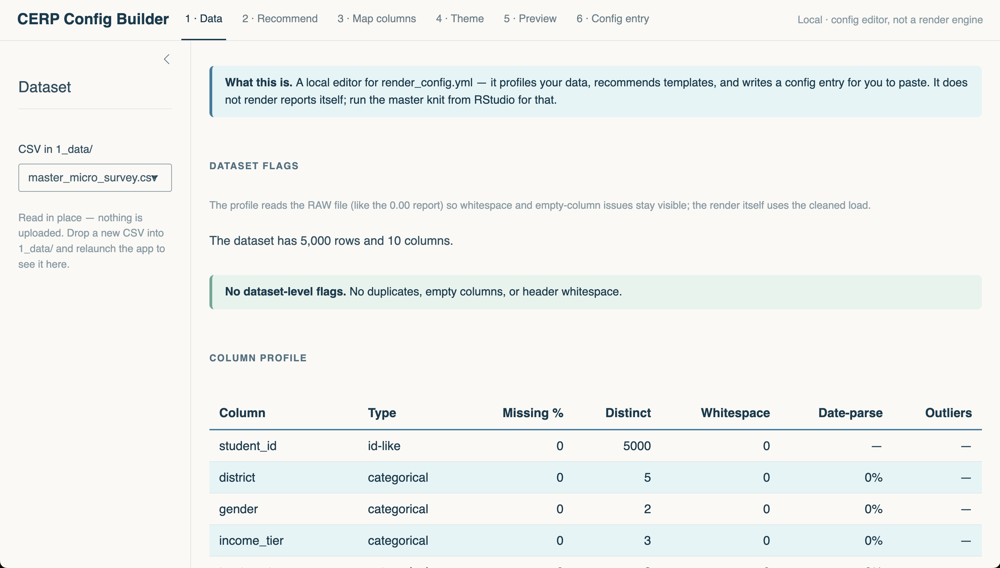
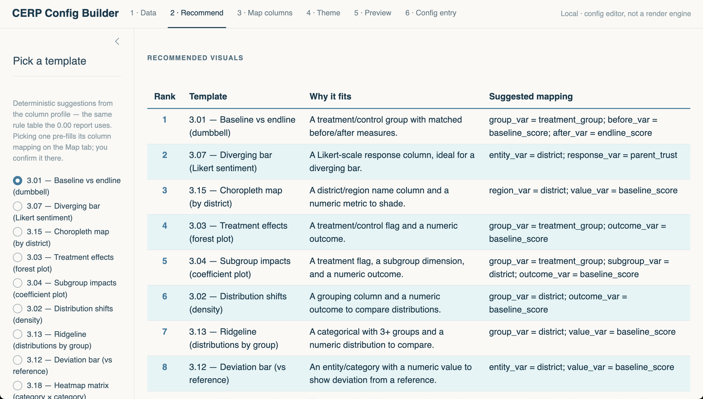
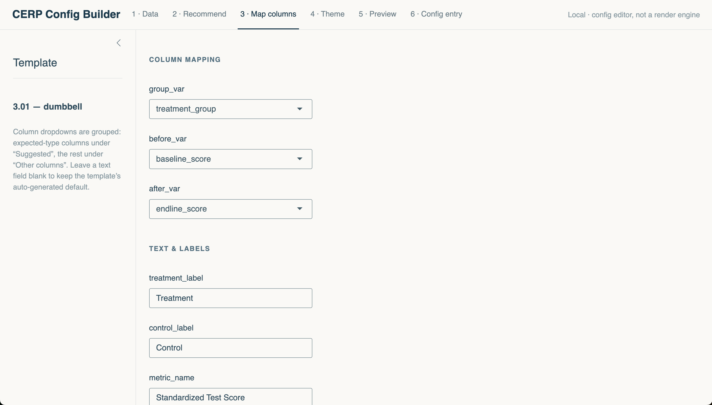
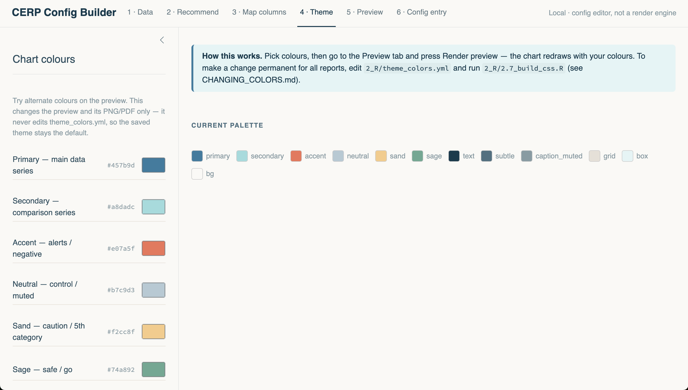
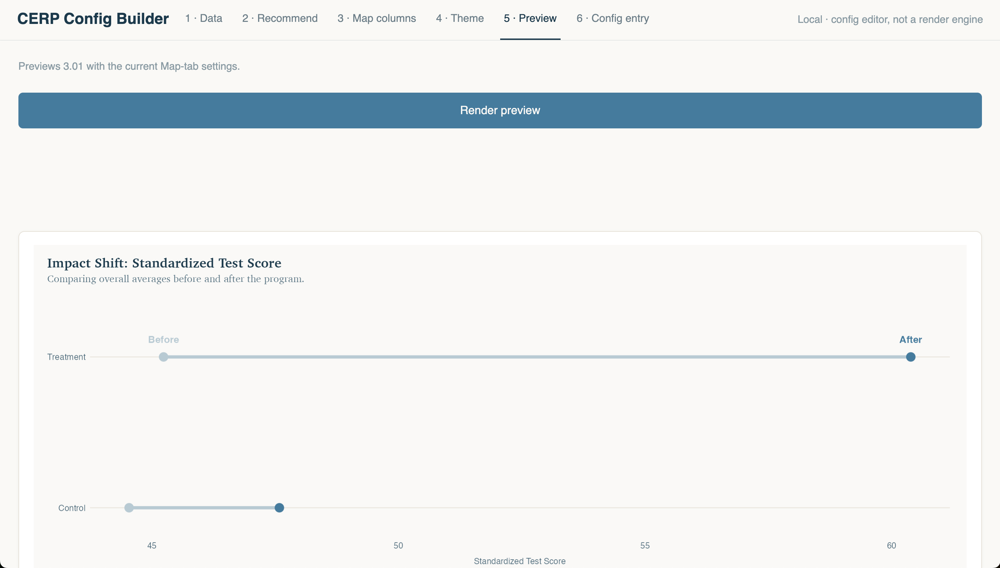
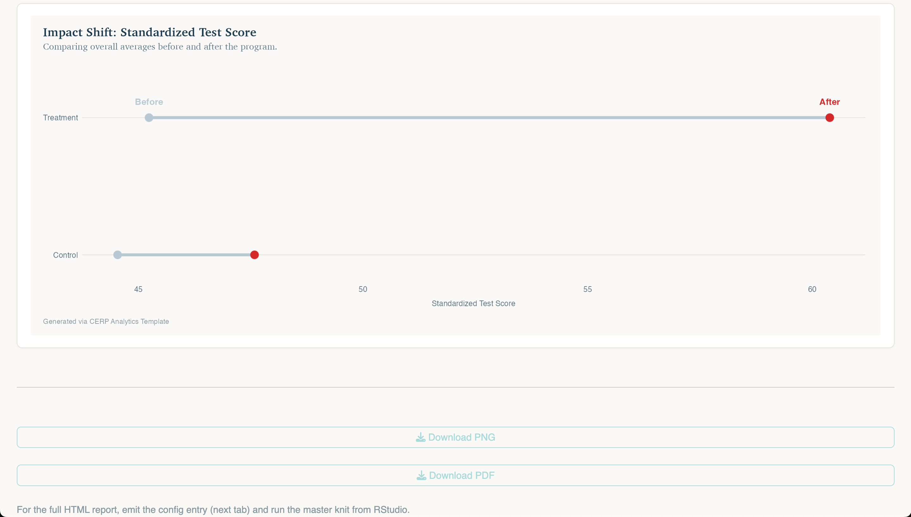
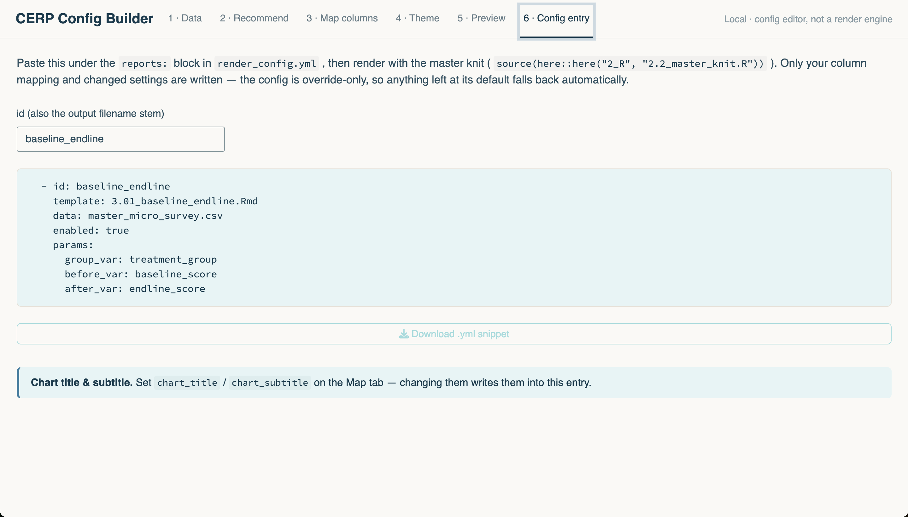

# CERP Config Builder — a guided tour

This is a visual walkthrough of the config-builder app in `6_shiny/`, captured
on the repo's **synthetic demo data** (`master_*.csv`). It exists so you can see
how the app works without installing anything. To actually run it, follow
[REPLICATION.md](../REPLICATION.md) to set up the project, then launch from the
project root:

```r
shiny::runApp(here::here("6_shiny"))
```

**What it is — and is not.** The app is a *local* front end to
`render_config.yml`: it profiles a CSV, recommends templates, lets you map
columns, previews the chart, and hands you a config entry to paste. It is not a
render engine — reports are still knitted from RStudio — and it never uploads
data or calls an external service. Field data stays on your machine.

The flow is six tabs, left to right.

## 1 · Data — profile the CSV

Pick a CSV from `1_data/` (read in place, never copied). The tab shows
dataset-level flags — duplicates, empty columns, header whitespace — and a
per-column profile: detected type, missingness, distinct values, date-parse
rate, outlier counts. It reads the *raw* file on purpose, so whitespace issues
stay visible here even though the render itself uses the cleaned load.



## 2 · Recommend — ranked template suggestions

The same deterministic recommender the `0.00` pre-flight report uses (one
shared rule table — `cerp_recommend()` in `2_R/2.5_helpers.R`) ranks the 23
production templates against the column profile, each with a "why it fits" and
a suggested column mapping. Picking one pre-fills the Map tab.



## 3 · Map columns — wire your data to the template

Every editable parameter from the template's YAML header becomes a control.
Column dropdowns are grouped — expected-type columns under "Suggested", the
rest under "Other columns" so a mis-detected column is never hard-blocked.
Blank text fields keep the template's auto-generated defaults.



## 4 · Theme — try colours (preview-only)

Native colour pickers, seeded from the live brand palette. Changes here
recolour the preview and its PNG/PDF downloads **for this session only** — the
app never writes `2_R/theme_colors.yml`, so the saved theme always stays the
default. To change colours permanently for all reports, edit
`theme_colors.yml` and run `2_R/2.7_build_css.R` (see
[CHANGING_COLORS.md](../CHANGING_COLORS.md)).



## 5 · Preview — the real chart, drawn by the real code

The preview calls the *same* `viz_*()` function the rendered report uses (all
chart logic lives in `2_R/2.6_viz_functions.R` — nothing is reimplemented), so
what you see is what the report will draw. Bad mappings fail loudly with the
validation error shown in a callout, not a blank panel. PNG and PDF downloads
come from the exact plot object shown.



With a Theme override active, the same preview redraws in your colours:



## 6 · Config entry — the hand-off

The end product: an override-only `reports:` entry to paste into
`render_config.yml`. Only your column mapping and changed settings are written;
everything left at its default falls back automatically. The app never edits
the config file itself — your commented config stays yours. Paste, then render
as usual with `source(here::here("2_R", "2.2_master_knit.R"))`.



---

*Screenshots captured on synthetic `master_micro_survey.csv` with template
3.01 (baseline/endline dumbbell). Colours shown in the recolour frames are
session-only overrides; the repo's saved theme is untouched.*
